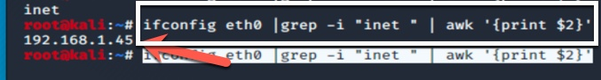

# Exercise #3

## Taking advantage of developers' misconfigurations.

### Preface: "I get it!" Developers have it hard, they are expected to very rapidly and correctly churn out business requirements "AS CODE". Sometimes, this can lead to shortcuts or just a "plain old copied sample" as code just to meet a need.

Let's look at the same exercise again from the perspective of the attacker.

#### Here we go ...

- Change directory so you are in the __<REPO_ROOT>/Exercises/Break/Files/break_e3/__ directory.
- Do a ```ls``` command to make sure, you should see:
```
about.html      break_e3.yml    dsvw.py     index.html
```
This is the __same__ code sample as before, just copied here for completeness and to keep stuff separate. Anyway ~
- Run the docker-compose command with our definition file.
```
docker-compose -f break_e3.yml up -d
```
This will start up a docker container with our app running inside it. Now go navigate your web browser to view it.
You can do this in many ways, but two come to mind. Use either your "host" browser or make use of the firefox browser within kali linux.

TO use your host browser, you will need to find your kali linux IP with a command something like this:

or just find it via the ```ifconfig eth0``` command.
Or again make use of the firefox browser within kali linux:


Then navigate to your new dev site: ```http://127.0.0.1:1234```


Or use your Host browser if you want ```http://<kali ip>:1234/```

## Did you find it?
### Looks like there is a R.C.E. (i.e. a "remote code execution") vulnerability in the "Kernelcon check" link. if you were to add a ```;``` followed by additional code; you gain code execution on the web server. Very Bad! Try it:
```
http://<your IP>:1234/?domain=kernelcon.org%3B%20ls
```
or try this one:
```
http://<your IP>:1234/?domain=kernelcon.org%3B%20echo%20%22(%E2%95%AF%C2%B0%E2%96%A1%C2%B0)%E2%95%AF%EF%B8%B5%20%E2%94%BB%E2%94%81%E2%94%BB%22%20%3E%20app%2Fabout.html
```
now go back and click on that __About us__ link.

## In and of itself, that R.C.E. IS bad, but could be contained within the container. The REAL issue stems from the fact that the developer left "read/write" access to their dev directory. (more on that later).

## When you are done, just pull down your dev. env. via the __docker-compose__ command again.
```
docker-compose -f break_e3.yml down
```

[Return to schedule](../../Docs/SCHEDULE.md)
