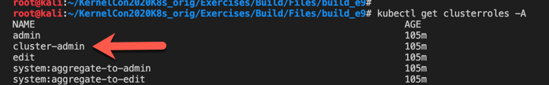

# Exercise 13 (Cluster authentication / Authorization)

## Preface:
Kubernetes has many authentication options, for "anonymous", "X.509 Cert","Static token","OpenID connect","JWT" just to name a few. Once you decide on one you really should make use of a "Role Based Access Control" and it just so happens that kubernetes has RBAC built into it.

###
### Please Note: Part of this Exercise is not complete. I am working on additional segment making use of the most excellent open source tool created by ___""___ called ___"[audit2rbac](https://github.com/liggitt/audit2rbac)"___
###

#### If you have a look at your config file; ``` cat ~/.kube/config ``` you will see that X.509 client certificates are used for authentication and the account "" is authorized under the ___"cluster-admin"___ role.



- you can use a ```krew``` plugin to view RBAC in a more human readable format. but the old 

```bash

cat <<EOF | kubectl apply -f -
apiVersion: rbac.authorization.k8s.io/v1
kind: Role
metadata:
  namespace: default # <- See this is scoped to a specific namespace
  name: pod-reader
rules:
- apiGroups: [""] # "" indicates the core API group
  resources: ["pods"]
  verbs: ["get", "watch", "list"]
EOF

```
- then you will need to ___"bind"___ that role to a user OR group (preferably a group)

```bash

cat <<EOF | kubectl apply -f -
apiVersion: rbac.authorization.k8s.io/v1
kind: RoleBinding
metadata:
  name: read-pods
  namespace: default
subjects:
# You can specify more than one "subject"
- kind: User
  name: jane # "name" is case sensitive
  apiGroup: rbac.authorization.k8s.io
roleRef:
  # "roleRef" specifies the binding to a Role / ClusterRole
  kind: Role #this must be Role or ClusterRole
  name: pod-reader # this must match the name of the Role
  apiGroup: rbac.authorization.k8s.io
EOF

```

#### The principle, is the same for "Cluster Roles" and "Cluster Bindings"
That said it may be difficult to keep up with all the resources needed and there attributes, etc. Which is why is helpful to use tools like ___"[audit2rbac](https://github.com/liggitt/audit2rbac)"___ but you would need metadata enabled within your api-server setup. If you do you will need options like "--audit-policy-file=/path" so you can then read it with such a tool like this.

```bash
### dump the logs into stdout, then into "audit2rbac" to have it build an RBAC file for default service account in the default namespace.

kubectl logs -f kube-apiserver-minikube -n  kube-system | grep audit.k8s.io/v1 | ./audit2rbac -f - --serviceaccount default:default > default-roles.yaml

```


## Review:


## Clean up:

```

 [Return to schedule](../../Docs/SCHEDULE.md)