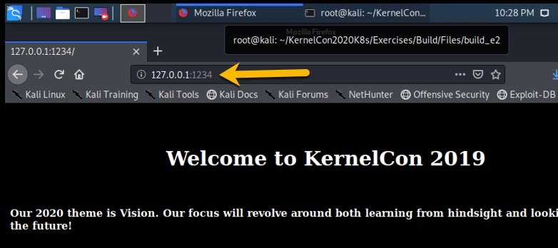

# Exercise #2

## Developing code and leveraging docker to do it!

### Preface: Most developers like to be able to write code and rapidly test it, (or "debug" it), in near "real-time". This "write then run, write then run" process may work well on their local system, but things can get complicated when new dependencies get added, or if the developer's system is not the same as "production", or even the same as a "user" environment.     Containers can be used to set up the execution environment as it is perceived by the process. This means that a developer can setup a "development environment" within a "container",  and then use it to "write then run, write then run" very rapidly, and be confident that the very same container, and very same code, will "run" correctly in another environment.
### In this exercise, you have a small "web app" that you are building for Kernelcon, and you are going to use [Docker Compose](https://docs.docker.com/compose/compose-file/) to start your "dev" environment, so that you can easily do your work. This is a VERY common set up...and WAY more common than you may think!

If you have not already done so, make sure to _login_ to the class docker registry
```
# echo "Roxx3znazUWqjL56yoSz" | docker login --username denver.cfman@gmail.com --password-stdin registry.gitlab.com
```
Note: Yes, that's a "'read-only'" user token (we will talk about this later)

#### Here we go ...

- Change directory so you are in the __<REPO_ROOT>/Exercises/Build/Files/build_e2/__ directory.
- Run an ```ls``` command to make sure you are in the correct directory, and you should see:
```
about.html      build_e2.yml    dsvw.py     index.html
```
- This is your "'development'" directory....yeah, you know,...it's where you keep your code ; Now you can make use of [Docker Compose](https://docs.docker.com/compose/compose-file/) to "spin up" your development environment.
- run the docker-compose command with the definition file.
```
docker-compose -f build_e2.yml up -d
```
This will start up a docker container with your app running inside it. Now, navigate to your web browser to view it.
You can do this in many ways, but two come to mind: 1) Use either your "host" browser or 2) make use of the firefox browser within kali linux.

To use your host browser (option 1), you will need to find your kali linux IP with a command something like this:

or just find it via the ```ifconfig eth0``` command.

Or, using option 2), again make use of the firefox browser within kali linux:


Then navigate to your new "dev" site: ```http://127.0.0.1:1234```


Or, use your Host browser, if you want ```http://<kali ip>:1234/```

## Oops ...
looks like our web developer forgot to update the site for 2020. Go ahead and edit the file __index.html__ with a program like __mousepad__ or __vi__ (sorry __emacs__ is not installed on kali by default). Then, just refresh your browser.


### See, "live" dev and run,...very convenient for developers.


## Have a look around your new dev site. There are some handy "clickable" links and utilities which you will use in another exercise.

## When you are done, just pull down your "dev" environment via the __docker-compose__ command again.
```
docker-compose -f build_e2.yml down
```

[Return to schedule](../../Docs/SCHEDULE.md)
