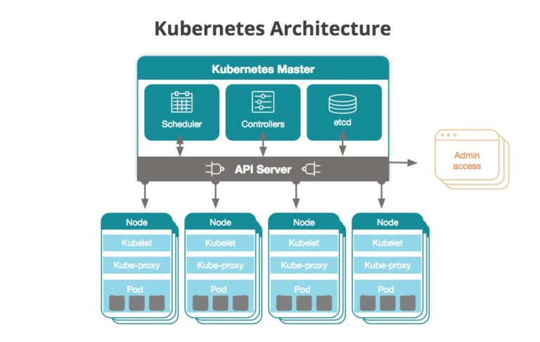
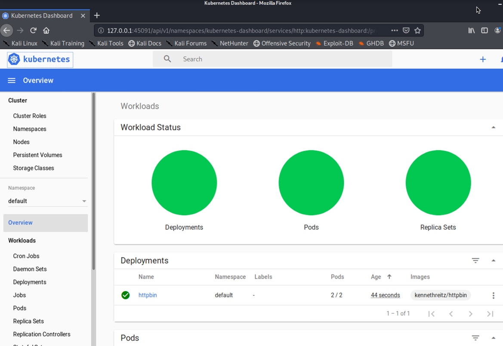

# Exercise #7 (k8s infrastructure basics: api-server, dns, resource types, etc.)

### Preface: [Kubernetes](https://kubernetes.io/) is an __Orchestration__ platform. Up till now we have been "spinning up" and "spinning down" containers manually. One at a time we have been isolating individual processes and running them via a container but in an automated environment or production envirement, we need a way to run multipl containers as well as update them; rotate them in and out of deployment; keep track of them etc. etc. This exercise will help you get familiar with the core concepts of kubernetes (k8s). 


###### Credit: Ali Gerrard (New Relic)

### At it's heart, K8s has a few services that make up it's core services (Scheduler, Controllers, config storage [etc] and API server) 

### Lets "start up" our cluster
- Make sure you have no configuration already.
```
rm -Rfv ~/.kube
minikube stop
minikube delete
rm -Rfv ~/.minikube
rm -Rfv /etc/kubernetes/*
rm -Rfv /var/lib/kubelet/*
```
- Then we start your cluster via __minikube__
```
# CHANGE_MINIKUBE_NONE_USER=true minikube start --vm-driver=none

⌛  Waiting for cluster to come online ...
🏄  Done! kubectl is now configured to use "minikube"
```
- Now you can validate that it's working by issuing your first command.
```
# kubectl get nodes

NAME       STATUS   ROLES    AGE     VERSION
minikube   Ready    master   8m35s   v1.17.0
```
## Great now we have a working __singe node__ kubernetes cluster running within your __kali linux__ instance.

## Lets explore. Because kubernetes requires authentication we will not be able to just access the api server directly.
Therefore we will need to either pass our k8s creds into the curl commands OR we can proxy our requests into k8s via __kubectl proxy__
```
# kubectl proxy --port=8080
```
- then we can access the api server via ANY other web tool (browser, curl, wget) etc. Lets make the same type of call as our __kubctl get nodes__ but via curl.
###### (in a separate terminal)
```
# curl http://localhost:8080/api/v1/nodes |jq '.items[].metadata.name'
```
<b style="color: #FF0000;">(when done close both terminals)</b></br>
## As you can see all functionality of the tool __kubectl__ can be accessed via the api natively, you just need to know the [api calls](https://kubernetes.io/docs/reference/generated/kubernetes-api/v1.10/#-strong-api-overview-strong-), in fact there are calls that you can only access outside of __kubectl__ but in general the "fat client" known as __kubectl__ will make your life easier not only as a developer, or defender but also as an attacker. Therefore red teams and pen-testers should keep arch specific builds of the __kubectl__ binary available during engagements as they can be copied over to comramized containers and use for pivot attacks. (more on that later :-) )

## By default and unless otherwise configured internal DNS is handled via the __kube-dns__ service it will automatically setup name resolution for pods, services and other objects created within the cluster. Lets create an example.
- Run the command below (all one command) to create a __deployment__
```
cat <<EOF | kubectl apply -f -
apiVersion: apps/v1
kind: Deployment
metadata:
  name: httpbin
spec:
  selector:
    matchLabels:
      run: httpbin
  replicas: 2
  template:
    metadata:
      labels:
        run: httpbin
    spec:
      containers:
      - name: httpbin
        image: kennethreitz/httpbin
        ports:
        - containerPort: 80
EOF
``` 
### Note: doing it this way will create an entire __deployment__ which is easier to work with.
- Then create a __service__ for that deployment.
```
cat <<EOF | kubectl apply -f -
apiVersion: v1
kind: Service
metadata:
  name: httpbin-svc
spec:
  selector:
    app: httpbin
  ports:
    - protocol: TCP
      port: 8888
      targetPort: 80
  type: ClusterIP
EOF
```
- now view your work.
```
# kubectl -n default get deployments
```
- then
```
# kubectl -n default get svc
```
## see we have 2 pods, both running the __httpbin__ container setup as a replica set, bound to a deployment, exposed via a service! Not bad; with those two little commands (could be a single yaml file) we have created a redundant yet deployable instruction set. If you want to view that, run a command like this:
```
# kubectl -n default get all 
```
## This new service __httpbin-svc__ can be used throughout the cluster via two dns records __"httpbin-svc"__ and it's F.Q.D.N. __"httpbin-svc.default.svc.cluster.local"__, again both records are created dynamically via the __kube-dns__ service running in the cluster.

# Web Gui
## If you would like to "see" your cluster via some kind of dashboard, kubernetes has you covered. simply deploy the __"kubernetes dashboard"__
- Enable the dashboard via minikube
```
minikube addons enable dashboard
```
- then run it via minikube as well
```
minikube dashboard


🔌  Enabling dashboard ...
🤔  Verifying dashboard health ...
🚀  Launching proxy ...
🤔  Verifying proxy health ...
http://127.0.0.1:45091/api/v1/namespaces/kubernetes-dashboard/services/http:kubernetes-dashboard:/proxy/
```
- then go to the link provided and view your dashboard. You should be able to see our deployment for __httpbin__ and it's service __httpbin-svc__ along with any other workloads in other namespaces etc.
### click around and have a look at some of the features. You can view, edit, deploy, revert, and many other actions within the cluster.


## Once done, simply Ctr-C out of the terminal running the kube-proxy (minikube dashboard command) this will kill the "port-forward" and tear down your session with the dashboard without leaving it open for attack (more on this later).

# Review: 
## Now we have our single node kubernetes cluster up and running. We deployed a simple service into it and reviewed how to see it, both via the "fat client", "api" and Web Gui Dashboard. In the next exercise we will discuss tools that will make our life easier as an Admin, Developer, Security practitioner and Pen-tester.


# Clean up: 
## We will leave the cluster up for the remaining exercises.
### Note: at any time within an adjacent terminal you can run ```minikube dashboard``` to bring up the Web Gui if you prefer to use it.

 
[Return to schedule](../../Docs/SCHEDULE.md)
