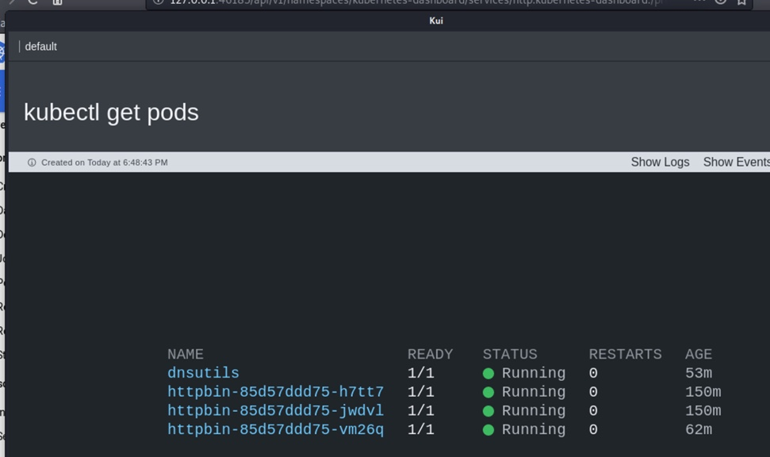

# Exercise #8 common tools and commands

## Preface:
### There are a wide number of tools and clients built for interaction with kubernetes. I wanted to focus on a few here because I believe they will benifit you throught this course and after when you use your own clusters. You will find that many of the day to day admin tasks as well as verifycation tasks can be reduces with many of these utilitys or tools.

| Tool Name | Purpose | Notes |
--- | --- | ---
[`kubectl`](#Kubectl) | core client | This is the Kubernetes [core client](https://kubernetes.io/docs/reference/kubectl/overview/) and is used primarly by anyone using or administration a cluster.
[`stern`](#Stern) | log review | In a cluster you may need to review logs "across" multiple running instances of containers, this [__third party__](https://github.com/wercker/stern) tool make it a little easier. 
[`helm`](#Helm) | deployment client | As you find you can deploy objects into k8s via yaml files, althow conveanent, [Helm](https://helm.sh/docs/intro/quickstart/) allows you to keep track of, rollback and package multiple containers or "deployments" into your cluster. You could think of it as __apt__ or __yum__ for your cluster but you package up your deployment.
[`kui`](#Kui) | kubectl plugin | This [third party extention](https://github.com/IBM/kui) is an interactive shell between you and kubectl, In addition you can use it to visulize your cluster, pods, deployment anything really.
[`krew`](#Krew) | kubectl plugin manager | As you will see there are many plugins for kubernetes, some of them are great and some of them are crap, but having a tiny package manager to allow you to get and install them is much easier then manual install.  
[`popeye`](#Popeye) | cluster security | This third party tool is designed to help you review the security posture of your cluster.

> There are many many more, and I could go on and on and on, however we cant spend all day installing and tweaking all the little goodies that make life within k8s easier, so we will stick with these ones for now.

<br/>
<br/>
<br/>
<br/>

## Kubectl
> Get all nodes
```bash
# kubectl get nodes
```
> Show me all pods (across all namespaces)
```bash
# kubectl get pods -A
```
> create resource(s)
```bash
# kubectl apply -f ./my-manifest.yaml
```
> delete resource(s)
```bash
# kubectl delete -f ./my-manifest.yaml
```
> port forward to a service (much like `ssh -L 8080:127.0.0.1:80` )
```bash
# kubectl -n default port-forward svc/httpbin-svc 8080:80
```
> copy a file from my local system into a specific pod
```bash
# kubectl -n devtest cp local.txt httpbin-85d57ddd75-h7tt7:/home/user/local.txt
```
> copy a file from a specific pod to my local system. (in the current dir)
```bash
# kubectl -n devtest cp httpbin-85d57ddd75-h7tt7:/home/user/local.txt .
```
> scale up the number of pods in a deployment
```bash
# kubectl -n default scale --current-replicas=2 --replicas=3 deployment/httpbin
```
> Attach to a givin shell or execute a speciffic process from within a speciffic container. lets assum you have temparaly deployed the test pod __dnsutils__ from the k8s examples like this ``` kubectl apply -f https://k8s.io/examples/admin/dns/dnsutils.yaml ``` and that it deployed correctly. If so, you could execute commands from "inside" like this ...
```bash
# kubectl exec -ti dnsutils -- nslookup kubernetes.default

Server:         10.96.0.10
Address:        10.96.0.10#53

Name:   kubernetes.default.svc.cluster.local
Address: 10.96.0.1
```


## Stern
### Stern will combine log streams from the kubelet controler (both stdout and stderr) into a single __log stream__ for a givin set of criteria, for exsample.
> show me all logs for all instances of __httpbin__ service. Stern will automaticly stay attached to this log stream until you __(Ctl+C)__ out of it.
```bash
# stern httpbin- --namespace=default
```
> using __stern__ like `grep -v`
```bash
# stern httpbin- --namespace=default -e DontWant
```
> using __stern__ like `grep -i`
```bash
# stern httpbin- --namespace=default -i error
```
> There are many diferent ways to use __stern__ execute `stern -h` to discover more.

## Helm
### Often thought of as the equlivent of __apt__ or __yum__ for your kubernetes cluster, [helm](https://helm.sh/docs/intro/quickstart/) is much more then a meare "package manager" exposing capabilitys like pre-deployment, post-deployment, tests and stupid easy rollback, it becomes a defacto task for many cluster admins to just `helm install` or `helm update` within there cluster.
> For example, you want to install a chat server within your cluster, it could be as easy as:
```bash
# helm install stable/rocketchat --set mongodb.mongodbPassword=$(echo -n $(openssl rand -base64 32)),mongodb.mongodbRootPassword=$(echo -n $(openssl rand -base64 32))
```
#### obvisly this does not take into account all the "bells and whistles" you may wish to include in such a deployment, but it's never more then a `--set` command option or a browse through the charts `values.yml` file. Giving you compleete control of your masive and complacated deployment.

## Kui
### As a plug-in for `kubectl`, `kui` gives you a "clickable" interface into your terminal; you can invoke it via the cli at the time of running commands:
##### Note: the option `--no-sandbox` is required inside of kali as we are running as root.
```bash
# kubectl kui get pods --ui --no-sandbox
``` 

#### Now all links are "clickable" you can easly move between pods and services, namespaces, logs etc. It sure beats typing commands over and over.


## Krew
### Foo

## Popeye
### Baz

