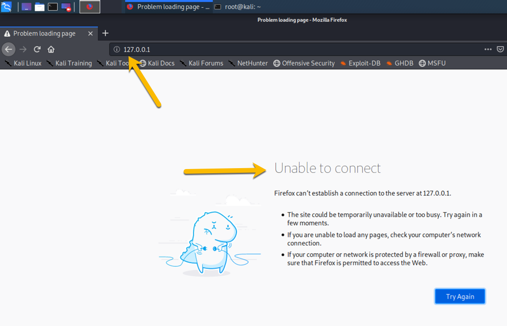
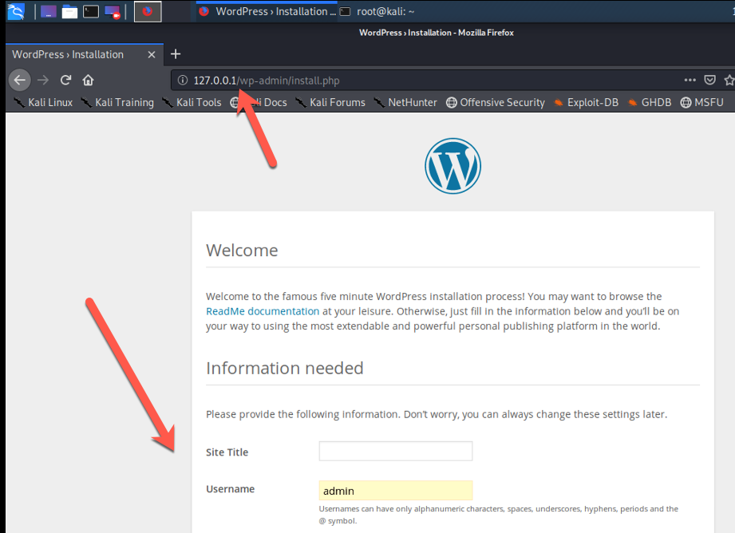
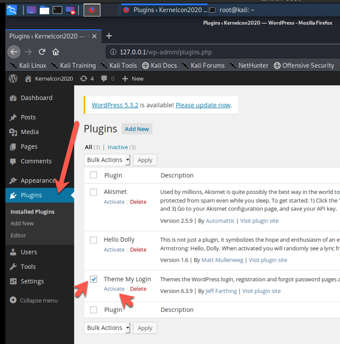

# Exercise #9
## Our Second workload.

### Lets get fimiure with deploying workloads in kubernetes.
### Before we get started, make sure minikube is running.
```bash
# minikube status
host: Running
kubelet: Running
apiserver: Running
kubeconfig: Configured
```

The quickest and easiest way is to "create" or "apply" a yaml definition file via the fat client ```kubectl```.

Navigate to the ```Exercises/Build/Files/build_e9``` folder and do an ```ls```, should look something like this.
```bash
# ls
01-pvc.yaml
02-mysql-configmap.yaml
03-mysql-deployment.yaml
04-wordpress-deployment.yaml
05-service.yaml
```
Before we startup the ___services___ we should set some passwords.
We can make use of the built in kubernetes secrets functionality. (more on that in later exercises).
```bash
kubectl create secret generic mysql-pass --from-literal=password='password'
```
And
```bash
kubectl create secret generic mysql-root-pass --from-literal=password='password'
```
You can use whatever you like, the text ___password___ is only a suggestion.

Now lets deploy them via the ```kubectl``` ___apply___ sub command, like this. (then we will take a look at them)
```bash
kubectl apply -f 01-pvc.yaml
kubectl apply -f 02-mysql-configmap.yaml
kubectl apply -f 03-mysql-deployment.yaml
kubectl apply -f 04-wordpress-deployment.yaml
kubectl apply -f 05-service.yaml
```
If it's working, a simpler ``` kubectl get pods ``` should return something like this:
```bash
NAME                         READY   STATUS    RESTARTS   AGE
mysql-6c8b769d74-m6vbr       1/1     Running   0          11h
wordpress-665977c8c7-bm6bb   1/1     Running   0          11h
```
If you are not familiar with kubernetes, this is two container images, along with their environmental configuration; running in two ___pods___ one in each. If you haven't guessed yet, this is a wordpress deployment. One ___php web server___ and the ___mySQL DB Server___ as it's backend.

Now lets connect to the Wordpress site: ``` http://127.0.0.1/ ```

### Just kidding: we need to setup ingress OR forwards network ports before we can access the ___service___ from anything outside the cluster (more on this later).
Crack open  a terminal and run this command:
```bash
# kubectl port-forward deployment/wordpress 80:80
Forwarding from 127.0.0.1:80 -> 80
Forwarding from [::1]:80 -> 80
```
Then open a browser window like before and navigate to ___[http://127.0.0.1/](http://127.0.0.1/)___ you should see a wordpress setup page. Please continue with the setup and login to the admin console.



Please make sure to navigate to the ___"Plug-ins"___ tab and select the ___"Theme My Login"___ plugin and ___"Activate"___ it. (We may need this later ;-) )




## Review: 
#### Looks Great! We have deployed a two tier WebApp within Kubernetes. This exercise is particularly helpful because it emphasizes just how easy it is to ___"spin up"___ workloads within this orchestration platform. It also eludes to common mistakes developers and first timers fall into when starting down the K8s path. Many assumptions are made, security controls circumvented and left to the reader to ___"deal with"___ later. 

## Clean up: 
#### Please DO NOT stop any services or tare down any of this exercise, we will use it during our next two segments.
 
[Return to schedule](../../Docs/SCHEDULE.md)
