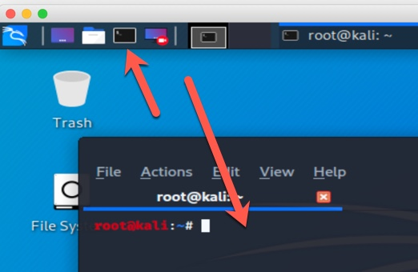

# Exercise (Builder)

## Title: docker-compose

### Preface: Developing milti-tier apps can be complacated and developers rarely have there own "stack" to build and debug on. After setting up a webserver a database server and who knows what else, they just don't have enugh time to keep such things up to date and properly configured; let alone spend time developing there own software. In this exersise we will "spin up" a set of container images to do our development on.

## Preperation:
Within your terminal, change directory (cd) into your home, then download or run the below commands.


1.) download the docker-compose yaml file or run the _cat_ command. (only do one)
```
# curl -LO 
```