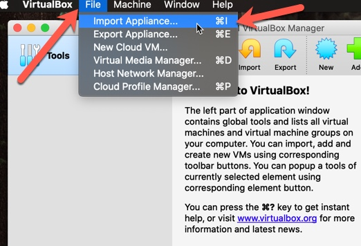
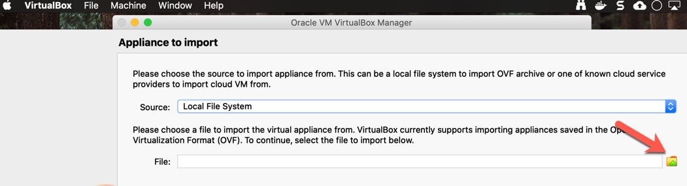
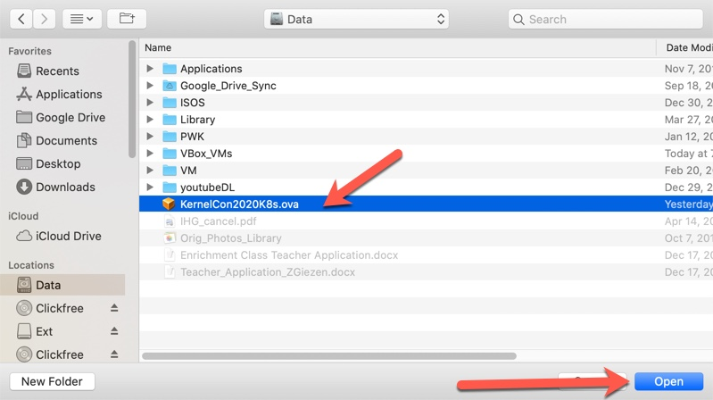
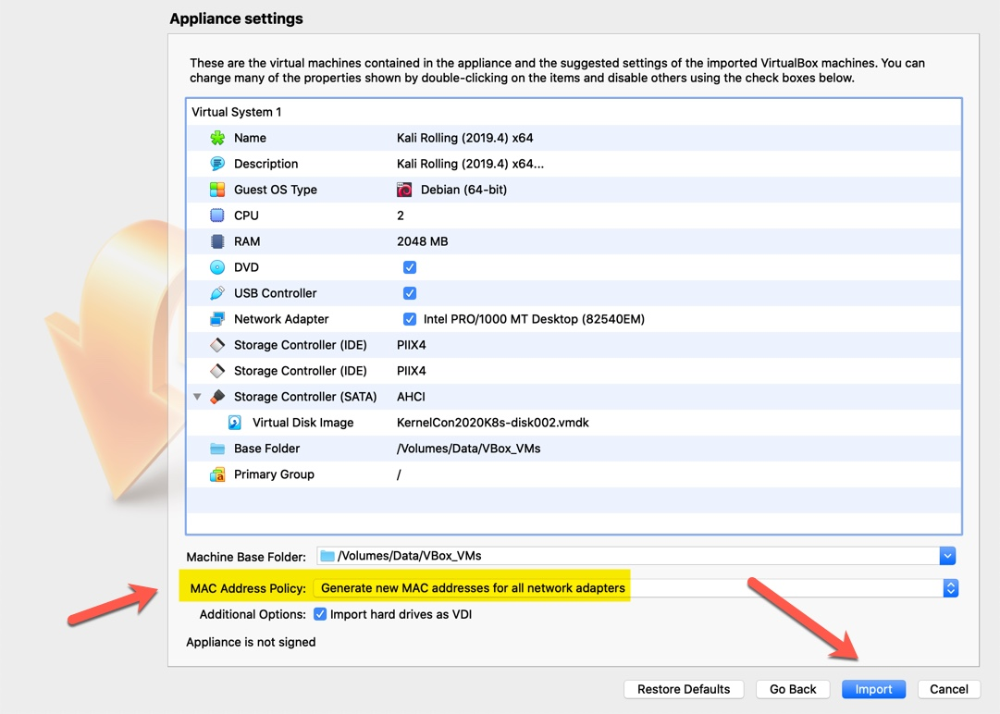

# Hypervisor setup ...

## This training will make use of a hypervisor to run our LAB envirnment. You may wish to use [VirtualBox](https://www.virtualbox.org/wiki/Downloads) or [VMWare Player](https://www.vmware.com/go/downloadworkstationplayer), however the supplied .ova .ovf file should be compatable with most any hypervisor available for your use.

### The supplied image is a "stock" [Kali Linux](https://www.offensive-security.com/kali-linux-vm-vmware-virtualbox-image-download/) image with the container runtime, minikube and k3s pre-installed for easy startup.

### If you need help setting up [VirtualBox](https://www.virtualbox.org/wiki/Downloads) for *macOS* please see [This Link](https://www.virtualbox.org/manual/UserManual.html#intro-installing)
### If you need help setting up [VirtualBox](https://www.virtualbox.org/wiki/Downloads) for *Windows* please see [This Link](https://www.virtualbox.org/manual/UserManual.html#intro-installing)
### If you need help setting up [VirtualBox](https://www.virtualbox.org/wiki/Downloads) for *Linux* please see [This Link](https://www.virtualbox.org/manual/UserManual.html#intro-installing)

### If you need help setting up [VMWare Player](https://www.vmware.com/go/downloadworkstationplayer) for *Windows* please see [This Link](http://pubs.vmware.com/player-12-windows/index.jsp)
### If you need help setting up [VMWare Player](https://www.vmware.com/go/downloadworkstationplayer) for *Linux* please see [This Link](http://pubs.vmware.com/player-12-linux/index.jsp)

The asumption is that you have a working *64bit* system you can install one of these hypervisers on (or already have installed). If you wish to install the binaries for this course on your own, please follow [This guide insted](../BININSTALL.md)

## Once you have a running hypervisor (VMWare Player or VirtualBox) please download the class "OVA image" below.

# The downloadable OVA file is [Here](https://drive.google.com/file/d/1fqhNfukZyvt3EM8WZgi5YJYjhuuT489e/view?usp=sharing)

Once you have downloaded your .ova file you will need to import it into Virtualbox.
- Select the __File__ main menu, then __Import Appliance__ from the menu.

- __Source__ should remain __Local File System__ then click on the *browse* icon next to __File__.

- Locate your downloaded file and hit Open.

- Please make sure to select __Generate new MAC addresses for all network adapters__ form the __MAC Address Policy:__ option before clicking the __Import__ button.

## Again this is a *Stock* [Kali Linux](https://www.kali.org/downloads/) image only edited to *add* the needed binaries for this course to make setup faster, you may wish to set it up your self via [this guide](../Setup/BININSTALL.md) insted.
